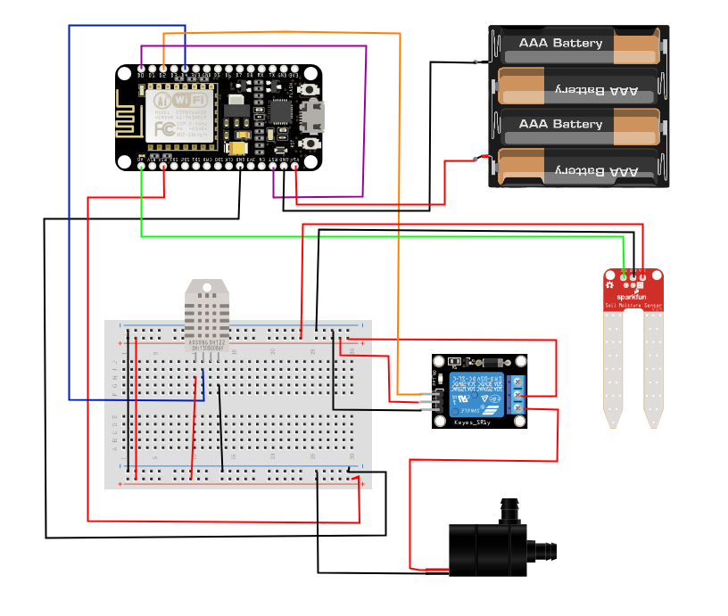

# SmartPlant watering system

This project uses an *ESP 8266 (NodeMCU)* to monitor the soil humidity of a plant and handles the watering of the plant itself by means of a water pump. The monitoring and the watering of the plant are accomplished by using several sensors and considering other environmental variables.

## Main Features

- **Sensors readings**
  - Soil humidity by means of a capacitive soil moisture sensor.
  - Environmental temperature and humidity by means of a DHT11 sensor.

- **Thresholds**
  - thresholds received by the server via MQTT

- **Watering decision** based on three conditions:
  - Soil humidity under a certain threshold
  - Environmental temperature over a certain maximum threshold
  - Environmental humidity under a certain threshold

- **Automatic calculation of watering duration**, based on:
  - Difference from target soil humidity
  - Temperature
    - if it's higher than the upper temperature threshold, it waters more
    - if it's lower than the lower temperature threshold, it waters less
  - Low environmental humidity
    - if it's under the environmental humidity threshold, it waters slightly more

- **Verification of actual watering**
  - to check whether the system has run out of water, or if a problem with the pump occurred

- **Data sent to the Server**
  - sensors data sent to the server

- **Deep sleep** for energy saving (external power supply, i.e. battery)

## Used Hardware and Sensors

- ESP8266 NodeMCU
- Analog capacitive soil moisture sensor
- DHT11 sensor (environmental temperature and humidity)
- 5V DC Water Pump + relay

## Circuit Scheme
